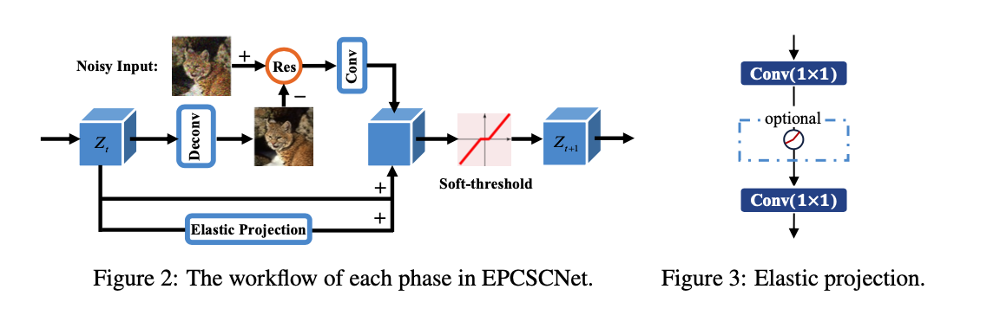

# Improving the Sparse Coding Model via Hybrid Priors

This repository contains two parts. We theoretically compare EPLISTA with prior works in sparse coding simulation experiments. 
For vision practice of image denoising, we implement EPCSCNet with Pytorch. 


## Part 1: Image Denoising with EPCSCNet


### Requirements

To install requirements:

```setup
pip install -r requirements.txt
```

Then prepare the dataset for training and evaluation. 


### Training for Gaussian Noise

The parameter *--sigma* controls the noise level. *--color* represent whether to process RGB color images. To train EPCSCNet in the paper, run this command:

```train
# for gray color image with a noise level of 50
python 1_train_gauss.py  --sigma=50 

# for gray color image with a noise level of 50
python 1_train_gauss.py  --sigma=50 --color
```

### Training for Real-World Noise

To train EPCSCNet on the SIDD dataset for real-world noise, just run:

```train
python 1_train_sidd.py  
```

### Evaluation

To evaluate EPCSCNet for Gaussian noise on the CBSD68 dataset, run:

```eval
# for gray image
python 2_test_gauss.py --sigma=50 

# for color image
python 2_test_gauss.py --sigma=50 --color
```


## Part 2: Sparse Codes recovery with EPLISTA
We follow the prior works and implement [EPLISTA](./core/EPLISTA.py) and [Tied-EPLISTA](./core/TiedEPLISTA.py) with Tensorflow. This part of codes are based on [the ALISTA repo](https://github.com/VITA-Group/ALISTA.git). You may first clone it and then add the two files into the "model" directory.


To run the simulation experiments for EPLISTA under a noise level of SNR=20dB, just run:
```
# For EPLISTA
python3 main.py --task_type sc -g 0 \
    --M 250 --N 500 --pnz 0.1 --SNR 20 --con_num 0\
    --column_normalize True\
    --net EPLISTA -T 10\
    --scope ELISTA --exp_id 0

```

To use a Tied version, run:
```
# For Tied-EPLISTA
python3 main.py --task_type sc -g 0 \
    --M 250 --N 500 --pnz 0.1 --SNR 20 --con_num 0\
    --column_normalize True\
    --net Tied_EPLISTA -T 10 -p 1.2 -maxp 13 \
    --scope EPLISTA --exp_id 0
```

